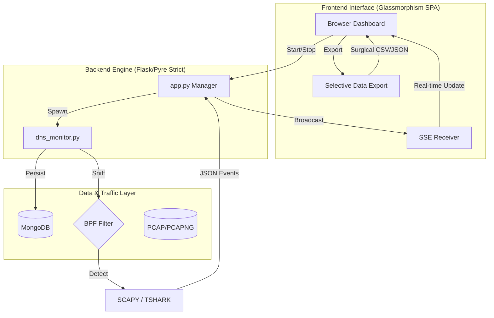

<div align="center">

```text
██████╗ ███╗   ██╗███████╗    ███████╗██╗███╗   ██╗██╗  ██╗██╗  ██╗ ██████╗ ██╗     ███████╗
██╔══██╗████╗  ██║██╔════╝    ██╔════╝██║████╗  ██║██║ ██╔╝██║  ██║██╔═══██╗██║     ██╔════╝
██║  ██║██╔██╗ ██║███████╗    ███████╗██║██╔██╗ ██║█████╔╝ ███████║██║   ██║██║     █████╗  
██║  ██║██║╚██╗██║╚════██║    ╚════██║██║██║╚██╗██║██╔═██╗ ██╔══██║██║   ██║██║     ██╔══╝  
██████╔╝██║ ╚████║███████║    ███████║██║██║ ╚████║██║  ██╗██║  ██║╚██████╔╝███████╗███████╗
╚═════╝ ╚═╝  ╚═══╝╚══════╝    ╚══════╝╚═╝╚═╝  ╚═══╝╚═╝  ╚═╝╚═╝  ╚═╝ ╚═════╝ ╚══════╝╚══════╝
```

**Advanced Real-Time DNS Telemetry & Threat Surveillance Console**

[](#)
[](#)
[](#)
[](#)
[](#)

</div>

---

<p align="center">
  <i>DNS Sinkhole provides a premium, tactical control surface for intercepting, analyzing, and persisting live DNS traffic telemetry and malicious PCAP artifacts.</i>
</p>

---

## ⚡ System Capabilities

`DNS Sinkhole` is built to replace heavy SIEM environments when all you need is lightning-fast, highly contextualized DNS analysis.

*   **🟢 Active Interception**: Start/stop live DNS capture natively from the browser using intelligent `scapy` or `tshark` engines.
*   **📡 Threat Intelligence Engine**: Automatically flags anomalous telemetry—detecting DGA domains via Shannon entropy, suspicious TLDs (`.tk`, `.top`), and DNS tunneling patterns.
*   **🛡️ Next-Gen Protocol Detection**: Out-of-the-box detection for standard `DNS`, `DNS-over-TCP`, `DoT` (853), `DoH` (443), and `DoQ` (UDP 443).
*   **🕵️‍♂️ Forensic Deep Replay**: Drag-and-drop `.pcap` / `.pcapng` artifacts directly into the glassmorphism dashboard for rapid static analysis.
*   **💾 Data Exfiltration**: One-click **CSV** and **JSON** exports from the browser. Supports surgical precision via **row-level checkboxes** to selectively export filtered timeline intelligence.
*   **✅ Zero-Error Architecture**: The backend Python scripts are 100% strictly typed using Meta's `Pyre` static analyzer, achieving deterministic thread-safe execution without runtime `NoneType` faults.

---

## 📊 Technical Intelligence Matrix

| Capability | Logic Engine | Analytics / Heuristics |
| :--- | :--- | :--- |
| **Protocol Detection** | Scapy / TShark | DNS, DNS-over-TCP, DoT (853), DoH (443), DoQ (UDP 443) |
| **DGA Analysis** | Shannon Entropy | Detects randomized domain strings with high character variability |
| **DNS Tunneling** | Subdomain Depth | Identifies excessive subdomain nesting and long query payloads |
| **Persistence** | MongoDB | Batch-inserts with `insert_many` optimized for high-throughput |
| **Export Formats** | PCAP, CSV, JSON | Surgical row-level selection or full-timeline extraction |
| **Typing Safety** | Pyre Strict | 100% Type-hinted architecture with zero implicit `Any` |

## 🖥️ Tactical Dashboard

The frontend is a hacker-themed, hardware-accelerated SPA featuring:
- **Glassmorphism UI** with ambient glow routing and scan-line animations.
- **Live Insight Grid** computing top targets, abusive domains, and active protocols.
- **Dynamic Threat Badges** parsing events into severity tiers (Low, Medium, High) with pulsing threat indicators.
- **Wide-View Topology**: CSS geometry natively accommodates dense 11-column DNS tables perfectly on ultra-wide desktop monitors without crushing internal metrics.
- **Real-time Engine** powered by raw Flask Server-Sent Events (SSE).

---

## 🚀 Quick Start & Deployment

### 📋 Prerequisites
*   Python 3.10 or higher
*   MongoDB (optional, for persistent storage)
*   Sudo/Admin privileges (for live packet capture)

### 1. Initialize Workspace
```bash
git clone https://github.com/your-username/DNS-sinkhole.git
cd DNS-sinkhole
```

### 2. Isolate Environment
```bash
python3 -m venv .venv
source .venv/bin/activate  # Windows: .venv\Scripts\activate
```

### 3. Install Payloads
```bash
pip install -r requirements.txt
```

### 4. Ignite Command Center
```bash
python3 app.py
```
> **TARGET ACQUIRED:** Navigate to `http://localhost:3000` to access the console.

---

## 🐧 Linux Intelligence Setup (Step-by-Step)

For high-performance tactical capture on Linux (Ubuntu/Debian/Kali), follow these precise vectors:

### 1. Hardening Dependencies
Ensure the system has the necessary headers for raw packet manipulation and native interface bindings:
```bash
sudo apt update
sudo apt install -y python3-dev libpcap-dev tshark
```

### 2. Capability Provisioning (Optional but Recommended)
To allow the sniffer to bind to raw interfaces without requiring `root` or `sudo` every time, grant the Python binary capture capabilities:
```bash
sudo setcap cap_net_raw,cap_net_admin=eip $(readlink -f $(which python3))
```

### 3. Service Orchestration
If using **MongoDB** for persistence, ensure the service is active and the URI in the dashboard matches your local instance:
```bash
sudo systemctl enable --now mongod
```

### 4. Headless Execution
For server environments where a GUI is unavailable, you can stream the monitor output directly to a background process:
```bash
nohup python3 app.py > console.log 2>&1 &
```
---

## 🛠️ Toolchain Modules

### PCAP Synthesis (`make_dns_pcap.py`)
Need to generate synthetic threat telemetry for testing? We built a dedicated payload generator that maps variadic targets to multi-threaded DNS resolution and outputs heavily customized PCAP traces, standard CSVs, and JSON logs.

```bash
# Generate a baseline "Normal" traffic PCAP
python scripts/make_dns_pcap.py --profile normal -o normal_traffic.pcap

# Generate a High-Severity "Suspicious" traffic PCAP (Incl. NXDOMAIN + TCP)
python scripts/make_dns_pcap.py --profile suspicious

# Export telemetry matrices cleanly into CSV / JSON while rendering PCAP
python scripts/make_dns_pcap.py --profile mixed --csv out.csv --json out.json
```

### Headless Monitoring (`dns_monitor.py`)
Run the core sniffer directly from the terminal without the dashboard UI.

```bash
# Live packet sniffing on eth0 -> MongoDB pipeline
python scripts/dns_monitor.py \
  --mode live \
  --interface eth0 \
  --preferred-tool auto \
  --mongo-uri mongodb://localhost:27017 \
  --mongo-db dns_sinkhole
```

---

## 🧩 Architecture Topography




---

## 🔒 Dependencies & Notes

*   **Python:** `3.10+` recommended.
*   **Permissions:** Live `eth0`/`wlan0` capture inherently requires `sudo` or Administrator privileges.
*   **Wireshark:** If `tshark` is not detected in your environment `PATH`, the sniffer gracefully falls back to `scapy`.
*   **MongoDB:** Optional. If deactivated, the Flask backend utilizes a rolling 500-event volatile memory buffer to prevent UI sluggishness.

---

<div align="center">
  <code>EOF. Disconnecting...</code>
</div>
